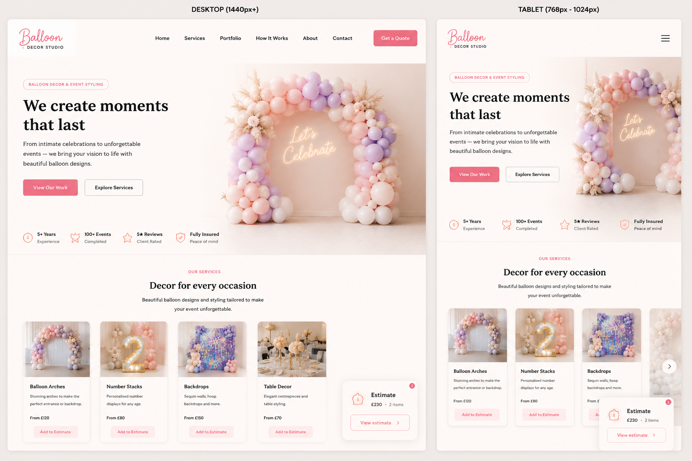

# Rainbow Me Decor Studio – Interactive Front End Website



**Live Website:** https://shvetsviktor.github.io/rainbow_me_deco/

## Overview

Rainbow Me Decor Studio is an interactive front-end website for a small event decoration business specialising in balloon arches, number stacks, backdrops, table decor, business decor, and custom event setups.

The project was created as a dynamic front-end web application for the Code Institute Unit 2 Interactive Front End Development assessment. It demonstrates responsive layout, user-centred design, JavaScript interactivity, DOM manipulation, external library integration, automated testing, accessibility considerations, and project documentation.

The website allows visitors to browse decoration services, view selected client work, filter portfolio examples by category, open portfolio images in a larger modal view, add services or portfolio examples to a guide estimate, review selected estimate items, remove items, and continue towards an enquiry form.

The project was developed incrementally using a test-driven approach where possible. Key behaviours were first described in Jest tests, then implemented in HTML, CSS, and JavaScript.

---

## Table of Contents

1. [Project Goals](#project-goals)
2. [Target Audience](#target-audience)
3. [User Stories](#user-stories)
4. [Success Criteria](#success-criteria)
5. [Five Planes of UX](#five-planes-of-ux)
6. [Development Process](#development-process)
7. [Features](#features)
8. [JavaScript Functionality](#javascript-functionality)
9. [Testing](#testing)
10. [Bugs](#bugs)
11. [Technologies Used](#technologies-used)
12. [Deployment](#deployment)
13. [Attribution, Credits and Acknowledgements](#attribution-credits-and-acknowledgements)
14. [Assessment Checklist](#assessment-checklist-pass--merit--distinction)
15. [Repo Structure](#repo-structure)
16. [Future Improvements](#future-improvements)

---

## Project Goals

### User Goals

- Understand what the decoration business offers.
- Browse decoration services quickly and clearly.
- See real examples of previous event decoration work.
- Filter portfolio examples by relevant decoration type.
- Open images in a larger view to inspect decoration details.
- Add services or portfolio examples to a guide estimate.
- Review selected estimate items before making an enquiry.
- Remove items from the estimate if they change their mind.
- Contact the business through a simple enquiry route.

### Site Owner Goals

- Present decoration services professionally.
- Showcase real client/gallery images instead of placeholder content.
- Help visitors understand available decoration categories.
- Encourage users to browse portfolio examples before making contact.
- Provide guide pricing to reduce repeated questions.
- Offer an interactive estimate builder to increase engagement.
- Keep project code, data, and assets organised for future maintenance.

### Assessment Goals

- Build a responsive front-end web application.
- Use custom JavaScript to respond to user actions.
- Demonstrate DOM manipulation and dynamic rendering.
- Use external JavaScript libraries appropriately.
- Organise code into separate HTML, CSS, and JavaScript files.
- Use Git and GitHub throughout development.
- Write automated tests for important functionality.
- Document UX decisions, development process, testing, bugs, and deployment.

---

## Target Audience

The target audience includes:

- Parents organising children’s birthday parties.
- Couples planning weddings or engagement celebrations.
- People planning baby showers, private parties, or family celebrations.
- Small businesses organising launches, displays, promotions, or seasonal events.
- Event planners looking for a balloon and event decoration supplier.

---

## User Stories

### US1 — Understand the Business

As a visitor, I want to understand what the business offers quickly so that I know whether it is relevant to my event.

**Acceptance Criteria:**

- The hero section clearly explains the service.
- The main call-to-action links are visible.
- The navigation is easy to understand.
- The services section is easy to find.

---

### US2 — Browse Services

As a visitor, I want to browse available decoration services so that I can decide whether the business offers what I need.

**Acceptance Criteria:**

- Services are shown in clear cards.
- Each service card includes an image, title, and short description.
- Each service card has a “View examples” button.
- Each service card has an “Add to estimate” button.
- The services layout remains usable on mobile and desktop.

---

### US3 — View Matching Examples from a Service

As a visitor, I want to click a service and see matching portfolio examples so that I can quickly find work relevant to that service.

**Acceptance Criteria:**

- Each service card has a category link.
- Clicking “View examples” scrolls to the portfolio section.
- The matching portfolio filter is activated.
- The portfolio carousel shows relevant examples.

---

### US4 — Browse Portfolio Examples

As a visitor, I want to view examples of previous work so that I can judge the style and quality before making an enquiry.

**Acceptance Criteria:**

- Portfolio cards are rendered dynamically from JavaScript data.
- Portfolio examples are displayed in a responsive carousel.
- Each portfolio item includes an image, title, description, and guide price.
- Portfolio images remain visually consistent across screen sizes.

---

### US5 — Filter Portfolio Examples

As a visitor, I want to filter portfolio examples by decoration type so that I can browse work that matches my event.

**Acceptance Criteria:**

- Portfolio filter buttons are visible above the carousel.
- Clicking a filter shows matching portfolio items.
- The active filter is visually highlighted.
- Portfolio items can belong to more than one category.
- The carousel updates after filtering.
- The carousel resets to the first matching item after a new filter is selected.
- No console errors occur when filtering.

---

### US6 — View Images Clearly

As a visitor, I want to open portfolio images in a larger view so that I can see decoration details more clearly.

**Acceptance Criteria:**

- Clicking a portfolio image opens a modal.
- The modal shows the selected image.
- The modal image `src` and `alt` are updated dynamically.
- The modal can be closed with the close button.
- The modal can be closed with the Escape key.
- The modal can be closed by clicking the backdrop.
- Focus moves to the close button when the modal opens.
- Focus returns to the original image button when the modal closes.

---

### US7 — Build a Guide Estimate

As a visitor, I want to add services and portfolio items to a guide estimate so that I can understand the approximate cost before sending an enquiry.

**Acceptance Criteria:**

- The user can add a service card to the estimate.
- The user can add a portfolio card to the estimate.
- Duplicate items are not added again.
- The estimate widget appears after an item is added.
- The estimate count updates.
- The estimate total updates.
- The estimate panel can be opened.
- Selected items are shown with image, title, and price.
- The user can remove selected items.
- The estimate UI hides when the last item is removed.
- A small balloon animation confirms when a new item is added.

---

### US8 — Use the Website on Mobile

As a mobile visitor, I want navigation and carousels to work comfortably so that I can browse the site on a phone.

**Acceptance Criteria:**

- The mobile navigation can be opened and closed.
- Navigation links close the mobile menu after selection.
- Services and portfolio carousels are swipe-friendly.
- Content fits without horizontal scrolling.
- Buttons and text remain readable.

---

### US9 — Send an Enquiry

As a visitor, I want to submit my event details through an enquiry form so that I can request a quote.

**Acceptance Criteria:**

- The enquiry section is available from navigation and call-to-action links.
- The form includes name, email, event type, message, and submit button.
- Required fields are marked in HTML.
- The form layout is ready for future JavaScript validation and real submission handling.

---

### US10 — Maintain the Website

As the site owner or developer, I want the code and assets to be organised clearly so that the website can be maintained and updated.

**Acceptance Criteria:**

- HTML, CSS, and JavaScript are separated.
- JavaScript files are organised by feature.
- Portfolio data is stored separately from markup.
- Portfolio items use a consistent `categories` array format.
- Test fixtures avoid repeated mock data.
- Image assets are stored in organised folders.
- File names are lowercase and descriptive.

---

## Success Criteria

This project is successful when:

- The website purpose is immediately clear.
- Navigation is simple and consistent.
- Services are presented clearly with images and actions.
- Portfolio examples are rendered dynamically.
- Portfolio filtering works with single-category and multi-category items.
- Portfolio carousel resets correctly after filtering.
- Portfolio images can be opened in an accessible modal.
- Estimate builder works from both service cards and portfolio cards.
- Estimate totals, item counts, images, and remove buttons update correctly.
- JavaScript functionality is split into external files.
- Automated tests cover important pure functions and DOM behaviour.
- The design is responsive across mobile, tablet, and desktop sizes.
- Interactive elements are understandable and feel clickable.
- External libraries and support are attributed.
- The README documents development process, testing, bugs, and future improvements.

---

## Five Planes of UX

The Five Planes of UX were used to organise design decisions from the broad purpose of the project through to the final visual interface.

### Strategy

The strategy is to help potential customers understand the service, trust the quality of previous work, and move towards an enquiry.

The project is based on three priorities:

- **Clarity:** users should quickly understand what Rainbow Me offers.
- **Confidence:** users should see real examples and guide prices before contacting the business.
- **Action:** users should be able to filter work, add items to an estimate, and continue towards enquiry.

### Scope

The current project includes:

- Responsive header and navigation.
- Hero section.
- Services Swiper carousel.
- Service cards with “View examples” and “Add to estimate” actions.
- Dynamic portfolio rendering.
- Portfolio Swiper carousel.
- Portfolio filter buttons.
- Multi-category portfolio data.
- Portfolio image modal.
- Estimate widget.
- Estimate panel.
- Add/remove estimate functionality.
- Balloon add animation.
- Enquiry form layout.
- Jest automated tests.
- Shared test fixtures.

Some sections are prepared but not fully completed yet, such as How It Works, Testimonials, full enquiry validation, and 404 page.

### Structure

The website uses a single-page structure:

1. **Header and Navigation**
2. **Hero**
3. **Services**
4. **Portfolio**
5. **Enquiry**
6. **Estimate Widget**
7. **Estimate Panel**
8. **Footer**

The How It Works and Testimonials sections are currently present as hidden placeholder sections and can be completed later.

### Skeleton / Wireframes

Wireframes were used to plan page layout, content hierarchy, and responsive behaviour before implementation.

| Mobile           | Desktop           |
| ---------------- | ----------------- |
| Mobile wireframe | Desktop wireframe |

The planned layout includes hero content, service cards, portfolio carousel, filter buttons, estimate widget, estimate panel, and enquiry form.

### Surface

The visual design is intended to feel:

- Clean
- Soft
- Friendly
- Elegant
- Celebratory
- Professional

Design decisions include:

- Light background.
- Pastel accent colour palette.
- Clear call-to-action buttons.
- Responsive cards.
- Consistent spacing.
- Real gallery images.
- Decorative balloon feedback animation.
- Pointer cursor on clickable buttons.

---

## Development Process

The project was developed incrementally over multiple stages. The approach changed during development as features became more complex, but the overall goal remained the same: build a dynamic, responsive, interactive front-end project with clear user value.

### Stage 1 — Project Idea and Structure

The project started as a portfolio-style website for balloon compositions and stage/event decoration. The idea was chosen because it allowed strong visual content, clear user interaction, and realistic business value.

Initial planning focused on:

- Page sections.
- Services.
- Portfolio.
- Estimate builder idea.
- Enquiry form.
- Responsive layout.
- Accessibility.
- Testing requirements.

### Stage 2 — HTML Structure and Early Tests

The first technical focus was to create a clear page structure and verify it with automated tests.

Tests were written for:

- Header.
- Navigation.
- Hero section.
- Services section.
- Portfolio section.
- Enquiry section.
- Footer.
- Key links.
- Images and alt text.
- Buttons and form elements.

This helped keep the HTML structure stable while new features were added.

### Stage 3 — Services Section and Swiper

The services section was built with six service categories:

- Balloon Arches
- Number Stacks
- Backdrops
- Table Decor
- Business Decor
- Custom Setups

A Swiper carousel was added to make service cards easier to browse on smaller screens. A custom services carousel script checks that the carousel element and Swiper library exist before initialising.

### Stage 4 — Dynamic Portfolio Rendering

The portfolio section was moved away from static HTML cards. Portfolio items are stored in `assets/js/portfolio-data.js` and rendered dynamically by JavaScript.

This made the project more maintainable because content data is separated from markup.

The render function creates:

- Portfolio article card.
- Image button.
- Image.
- Title.
- Description.
- Price wrapper.
- Add to estimate button.

### Stage 5 — Portfolio Carousel

The dynamically rendered portfolio cards are displayed in a Swiper carousel.

This keeps the page compact, especially on mobile, and allows visitors to browse images without the page becoming too long.

### Stage 6 — Portfolio Filtering

Portfolio filter buttons were added above the carousel.

The first version used a single category value on each portfolio item:

```js
category: 'balloon-arches';
```

Later, the data model was improved to allow items to belong to multiple categories:

```js
categories: ['balloon-arches', 'backdrops'];
```

This was a more flexible solution because a real decoration photo can show both a balloon arch and a backdrop.

The filter logic now checks whether the selected category is included in the item’s `categories` array.

### Stage 7 — Services Linked to Portfolio Filters

Service cards were connected to matching portfolio filters.

When a visitor clicks “View examples” on a service card:

1. JavaScript reads the service category.
2. It finds the matching portfolio filter button.
3. It triggers that filter.
4. It scrolls to the portfolio section.

This connects the Services and Portfolio sections into one user journey.

### Stage 8 — Portfolio Modal

A portfolio image modal was added so users can view images in a larger format.

The modal supports:

- Opening from image button.
- Dynamic image source.
- Dynamic alt text.
- Close button.
- Escape key.
- Backdrop click.
- Focus movement to close button.
- Focus return to original image button.

This improves accessibility and user control.

### Stage 9 — Estimate Builder Pure Functions

The estimate builder was first developed with pure JavaScript functions:

- `addItemToEstimate`
- `calculateEstimateTotal`
- `removeItemFromEstimate`

These functions were tested separately from the DOM. This made the estimate logic easier to understand and verify.

### Stage 10 — Estimate Builder DOM Behaviour

The estimate builder was then connected to the page.

Users can add items from:

- Portfolio cards.
- Service cards.

The estimate UI includes:

- Floating/sticky estimate widget.
- Item count badge.
- Estimated total.
- View estimate button.
- Estimate panel.
- Remove buttons.
- Selected item image, title, and price.
- Backdrop.
- Escape key support.

### Stage 11 — Estimate Images and Service Data

The estimate panel was improved to show selected item images.

Portfolio items already had image and alt data. Service buttons were updated with:

- `data-title`
- `data-price`
- `data-image`
- `data-alt`

This allows service-added items and portfolio-added items to be rendered consistently inside the estimate panel.

### Stage 12 — Balloon Add Animation

A decorative balloon animation was added when the user adds a new item to the estimate.

The animation appears near the clicked button and gives visual feedback that the action worked.

The animation only appears when a new item is actually added, not when the user clicks a duplicate item.

### Stage 13 — Image Migration

The project moved from placeholder/service-specific image folders to real client/gallery images.

The image structure was simplified to use:

```text
assets/images/gallery/
```

This avoids unnecessary duplication between services and portfolio images.

Service card images, service estimate data, portfolio item data, and test fixtures were updated to use the new gallery image paths.

### Stage 14 — Shared Test Fixtures

The tests originally repeated small portfolio item arrays in multiple files.

This was refactored into a shared fixture:

```text
tests/fixtures/portfolio-items.js
```

This keeps test data consistent and avoids repeating the same mock portfolio items across multiple test files.

### Stage 15 — Test Organisation

Tests were grouped using `describe` blocks.

Examples:

- `Estimate pure functions`
- `Estimate builder`
- `Portfolio filtering`
- `Portfolio image modal`
- `Portfolio rendering`
- `Main navigation behavior`

This made the test suite easier to read and understand.

### Stage 16 — Carousel Reset Bug Fix

A bug was found in the portfolio carousel after filtering.

When a user swiped to a later portfolio slide and then selected a new filter, the carousel kept the previous slide index. The filtered cards changed, but the carousel did not return to the first matching item.

The fix updates the Swiper instance and moves it back to slide `0` after filtering.

### Stage 17 — Styling and Interaction Refinement

CSS was refined during development to improve spacing, responsiveness, button behaviour, estimate panel layout, and visual feedback.

A pointer cursor was added for key clickable buttons so interactive elements feel clickable.

---

## Features

### Hero

The hero section introduces the business and includes two call-to-action links:

- View Portfolio
- Get a Quote

### Main Navigation

The navigation links to the main page sections.

The mobile menu can be opened and closed with a menu button. When a navigation link is clicked, the mobile menu closes.

### Services Carousel

The services section uses Swiper.js to display service cards.

Each service card includes:

- Image.
- Heading.
- Description.
- “View examples” button.
- “Add to estimate” button.

The services use real gallery images from `assets/images/gallery/`.

### Portfolio

Portfolio cards are rendered dynamically from `portfolio-data.js`.

Each portfolio item contains:

- `id`
- `title`
- `categories`
- `image`
- `alt`
- `description`
- `price`

### Portfolio Filtering

Portfolio filters allow users to filter by:

- All
- Balloon Arches
- Number Stacks
- Backdrops
- Table Decor
- Business Decor
- Custom Setups

The filtering supports multiple categories per portfolio item.

After filtering, the portfolio carousel resets to the first matching slide.

### Portfolio Image Modal

The modal lets users view larger portfolio images.

It supports close button, Escape key, backdrop click, and focus return.

### Estimate Widget

The estimate widget appears after the first item is added.

It shows:

- Current estimate total.
- Item count.
- View estimate button.
- Count badge.

### Estimate Panel

The estimate panel shows selected items with:

- Image.
- Title.
- Price.
- Remove button.

It also shows the current total and a Request a Quote button.

### Add to Estimate

Users can add items from both service cards and portfolio cards.

Duplicate items are prevented.

### Remove from Estimate

Users can remove items from the estimate panel.

When the final item is removed, the estimate UI hides.

### Balloon Add Animation

A small balloon animation appears near the clicked Add to Estimate button when a new item is added.

### Enquiry Form Layout

The enquiry section includes:

- Name input.
- Email input.
- Event type dropdown.
- Message textarea.
- Request a Quote button.

The form is ready for future validation and submission functionality.

---

## JavaScript Functionality

### `assets/js/navigation.js`

Handles mobile navigation:

- Toggles menu open and closed.
- Updates `aria-expanded`.
- Closes navigation after link click.

### `assets/js/swiper-helpers.js`

Contains shared Swiper helper logic.

Current helper:

- Removes pagination bullets from keyboard tab order.

### `assets/js/services-carousel.js`

Initialises the services Swiper carousel.

It uses defensive checks to avoid console errors if Swiper or the carousel element is missing.

### `assets/js/portfolio-data.js`

Stores portfolio data separately from HTML.

The data uses `categories` arrays instead of a single `category` property.

### `assets/js/portfolio-carousel.js`

Renders portfolio cards and initialises the portfolio Swiper carousel.

Responsibilities:

- Create DOM elements.
- Render images and text.
- Render price wrapper.
- Render Add to Estimate button.
- Initialise Swiper.

### `assets/js/portfolio-filters.js`

Handles portfolio filtering.

Responsibilities:

- Store filter button data.
- Render filter buttons.
- Set active filter state.
- Filter portfolio items.
- Re-render matching portfolio cards.
- Update Swiper after filtering.
- Reset Swiper to the first slide after filtering.
- Link service buttons to matching portfolio filters.

### `assets/js/portfolio-modal.js`

Handles image modal behaviour.

Responsibilities:

- Open modal.
- Update modal image.
- Close modal.
- Handle Escape key.
- Handle backdrop click.
- Move focus into modal.
- Return focus after closing.

### `assets/js/estimate.js`

Handles estimate builder functionality.

Pure functions:

- `addItemToEstimate`
- `calculateEstimateTotal`
- `removeItemFromEstimate`

DOM behaviour:

- Add portfolio item to estimate.
- Add service item to estimate.
- Prevent duplicates.
- Update widget.
- Open panel.
- Close panel.
- Remove items.
- Hide UI when estimate is empty.
- Render selected item images.
- Show balloon animation.

### `assets/js/script.js`

Acts as the main entry point.

It initialises project functionality after the required scripts and data have loaded.

---

## Testing

Testing was a major part of the project development process. Automated Jest tests were used to check pure JavaScript functions and DOM behaviour.

Manual testing is also planned for layout, responsiveness, accessibility, and deployed behaviour.

### Automated Testing

Automated tests are stored in the `tests/` folder.

| Test File                         | Purpose                                                                                                                                                         |
| --------------------------------- | --------------------------------------------------------------------------------------------------------------------------------------------------------------- |
| `tests/estimate.test.js`          | Tests pure estimate functions: add item, prevent duplicate, calculate total, remove item.                                                                       |
| `tests/estimate-dom.test.js`      | Tests estimate widget, panel, service item adding, portfolio item adding, item removal, selected images, backdrop behaviour, Escape key, and balloon animation. |
| `tests/html-structure.test.js`    | Tests main page structure, sections, navigation links, service cards, portfolio structure, estimate widget, and enquiry form layout.                            |
| `tests/navigation.test.js`        | Tests mobile menu toggle and closing menu after link click.                                                                                                     |
| `tests/portfolio-filters.test.js` | Tests filter data, rendering filter buttons, active filter state, filtering, service-to-portfolio filter links, and multi-category filtering.                   |
| `tests/portfolio-modal.test.js`   | Tests modal opening, closing, Escape key, backdrop click, focus movement, and focus return.                                                                     |
| `tests/portfolio-render.test.js`  | Tests dynamic portfolio card rendering and portfolio Swiper initialisation.                                                                                     |
| `tests/swiper-helpers.test.js`    | Tests that Swiper pagination bullets are removed from keyboard tab order.                                                                                       |

### Shared Test Fixtures

Reusable test portfolio items are stored in:

```text
tests/fixtures/portfolio-items.js
```

This avoids repeating the same portfolio mock data across several test files.

### Running Tests

```bash
npm test
```

### Automated Test Coverage Summary

Automated tests cover:

- Estimate pure functions.
- Estimate DOM behaviour.
- Adding service items.
- Adding portfolio items.
- Removing estimate items.
- Estimate total updates.
- Estimate count updates.
- Estimate selected item image rendering.
- Balloon animation creation and positioning.
- Portfolio rendering.
- Portfolio filtering.
- Multi-category filtering.
- Service buttons triggering matching portfolio filters.
- Portfolio modal behaviour.
- Modal keyboard behaviour.
- Modal focus management.
- Mobile navigation.
- Swiper pagination accessibility helper.
- Static HTML structure.

---

## Manual Testing Checklist

| Feature            | Test                       | Expected Result                          | Status  |
| ------------------ | -------------------------- | ---------------------------------------- | ------- |
| Navigation         | Click each navigation link | Correct section is shown                 | Pending |
| Mobile Navigation  | Click menu button          | Menu opens and closes                    | Pending |
| Mobile Navigation  | Click a nav link           | Menu closes after link click             | Pending |
| Hero CTA           | Click “View Portfolio”     | Portfolio section is shown               | Pending |
| Hero CTA           | Click “Get a Quote”        | Enquiry section is shown                 | Pending |
| Services           | View services section      | Six service cards are displayed          | Pending |
| Services Carousel  | Swipe on mobile            | Carousel moves through service cards     | Pending |
| Services           | Click “View examples”      | Matching portfolio filter is selected    | Pending |
| Services           | Click “Add to estimate”    | Service is added to estimate             | Pending |
| Portfolio          | Load page                  | Portfolio cards are rendered dynamically | Pending |
| Portfolio Carousel | Swipe portfolio carousel   | Slides move correctly                    | Pending |
| Portfolio Filter   | Click “Balloon Arches”     | Matching items are shown                 | Pending |
| Portfolio Filter   | Click “Backdrops”          | Matching items are shown                 | Pending |
| Portfolio Filter   | Click “All”                | All items are shown                      | Pending |
| Portfolio Filter   | Filter after swiping       | Carousel resets to first matching item   | Pending |
| Portfolio Modal    | Click image                | Modal opens with selected image          | Pending |
| Portfolio Modal    | Click close button         | Modal closes                             | Pending |
| Portfolio Modal    | Press Escape               | Modal closes                             | Pending |
| Portfolio Modal    | Click backdrop             | Modal closes                             | Pending |
| Estimate           | Add portfolio item         | Item appears in estimate                 | Pending |
| Estimate           | Add service item           | Item appears in estimate                 | Pending |
| Estimate           | Add duplicate item         | Duplicate is not added                   | Pending |
| Estimate           | Open estimate panel        | Selected items are shown                 | Pending |
| Estimate           | Remove item                | Item is removed and total updates        | Pending |
| Estimate           | Remove final item          | Estimate UI hides                        | Pending |
| Enquiry            | View enquiry form          | Form fields are visible                  | Pending |
| Responsive         | Test 320px width           | No horizontal scroll                     | Pending |
| Responsive         | Test tablet width          | Layout remains readable                  | Pending |
| Responsive         | Test desktop width         | Layout remains balanced                  | Pending |
| Console            | Perform main user actions  | No console errors                        | Pending |

---

## Accessibility Considerations

Accessibility was considered during development.

Implemented or planned accessibility decisions include:

- Semantic HTML structure.
- Alt text for images.
- `aria-label` for important interactive controls.
- `aria-pressed` for active portfolio filter buttons.
- `aria-expanded` for the mobile navigation button.
- Modal close button.
- Escape key support for modal and estimate panel.
- Focus movement into the image modal.
- Focus return after modal close.
- Removing decorative Swiper pagination bullets from keyboard tab order.
- Pointer cursor on clickable button elements.
- Meaningful button text.

---

## Validation

### HTML Validation

HTML will be tested using the W3C HTML Validator.


**Result:** Pending.

### CSS Validation

CSS will be tested using the W3C Jigsaw CSS Validator.


**Result:** Pending.

### JavaScript Linting

JavaScript will be tested using a linter.


**Result:** Pending.

### Lighthouse Testing

The deployed website will be tested using Lighthouse in Chrome DevTools.


### Planned Lighthouse Targets

| Category       | Target |
| -------------- | -----: |
| Performance    |    80+ |
| Accessibility  |    90+ |
| Best Practices |    90+ |
| SEO            |    90+ |

---

## Bugs

### Fixed Bugs

| Bug                                                                        | Cause                                                                                   | Fix                                                                                    |
| -------------------------------------------------------------------------- | --------------------------------------------------------------------------------------- | -------------------------------------------------------------------------------------- |
| Portfolio filtering failed after changing from `category` to `categories`. | Some test data and project data still used the old single-category format.              | Portfolio items and test fixtures were migrated to the `categories` array format.      |
| Portfolio carousel did not reset after filtering.                          | Swiper kept the previous active slide index after the DOM was re-rendered.              | After filtering, Swiper is updated and moved back to slide `0`.                        |
| Service items in the estimate did not have images.                         | Service buttons originally only provided title and price.                               | Service buttons were updated with `data-image` and `data-alt`.                         |
| Estimate panel did not show selected item images.                          | Estimate list rendering only included text and price.                                   | Estimate list items now render image, title, price, and remove button.                 |
| Repeated portfolio mock data existed across several tests.                 | Each test file created its own mock portfolio array.                                    | Shared fixture data was moved to `tests/fixtures/portfolio-items.js`.                  |
| Jest failed because `serviceAddButton` was declared twice.                 | During test refactoring, the helper return and manual query used the same `const` name. | Duplicate declaration was removed.                                                     |
| Portfolio and services used separate image folders.                        | Placeholder images were organised separately from real gallery images.                  | Services and portfolio data were migrated to `assets/images/gallery/`.                 |
| Portfolio card filtering did not support items with multiple visual roles. | A single `category` string was too limited.                                             | Items now use `categories` arrays, allowing one item to appear under multiple filters. |
| Swiper pagination bullets could receive keyboard focus unnecessarily.      | Swiper generated pagination bullets with tab focus.                                     | A helper removes pagination bullets from the keyboard tab order.                       |

### Bug Story: Portfolio Carousel Reset After Filtering

#### Title

Portfolio carousel keeps previous slide position after selecting a new filter.

#### User Story

As a visitor, I want the portfolio carousel to start from the first matching item after I select a new filter, so that I can browse the selected category from the beginning instead of landing on a later slide.

#### Steps to Reproduce

1. Open the website.
2. Go to the Portfolio section.
3. Swipe or click through the portfolio carousel to a later slide.
4. Click a different portfolio filter.
5. Observe the carousel position.

#### Expected Result

The filtered portfolio carousel starts from the first matching item.

#### Actual Result

The portfolio content updates, but the carousel keeps the previous slide index.

#### Cause

Swiper keeps its previous active slide index after the slide DOM is re-rendered.

#### Fix

After filtering and re-rendering the slides, the Swiper instance is updated and moved back to the first slide.

```js
if (portfolioSwiperElement && portfolioSwiperElement.swiper) {
  portfolioSwiperElement.swiper.update();
  portfolioSwiperElement.swiper.slideTo(0, 0);
}
```

#### Status

Fixed.

### Known Bugs

No confirmed active bugs are currently documented.

### Development Notes

The How It Works section, Testimonials section, custom 404 page, and full enquiry form validation are planned or partially prepared but not fully completed in the current version.

---

## Technologies Used

### Main Technologies

- HTML5
- CSS3
- JavaScript

### Libraries

- Swiper.js
- Google Fonts

### Testing

- Jest
- Jest jsdom environment

### Development Tools

- Visual Studio Code
- Chrome DevTools
- Git
- GitHub
- GitHub Pages

### Validation and Audit Tools

- W3C HTML Validator
- W3C CSS Validator / Jigsaw
- Lighthouse
- JavaScript linting tools

### Image Tools

- WebP image format.
- Local image conversion and optimisation workflow.

---

## Deployment

The project is deployed to GitHub Pages.

### Deployment Steps

1. Create a GitHub repository.
2. Push the project files to GitHub.
3. Open the repository on GitHub.
4. Go to **Settings**.
5. Select **Pages**.
6. Under **Build and deployment**, choose:
   - Source: Deploy from a branch
   - Branch: `main`
   - Folder: `/root`
7. Save the settings.
8. Wait for GitHub Pages to build the site.
9. Open the live URL.
10. Test the deployed version against the local version.

### Local Development

To run the project locally:

```bash
python3 -m http.server
```

Then open:

```text
http://localhost:8000
```

---

## Attribution, Credits and Acknowledgements

### Libraries and Tools

- **Swiper.js:** Used for the responsive Services and Portfolio carousels.
- **Google Fonts:** Used for typography.
- **Jest:** Used for automated JavaScript testing.
- **Jest jsdom:** Used to test DOM-based JavaScript behaviour.
- **Chrome DevTools:** Used for layout testing, debugging, console checks, and Lighthouse.
- **W3C HTML Validator:** Used for HTML validation.
- **Jigsaw CSS Validator:** Used for CSS validation.
- **Git and GitHub:** Used for version control.
- **GitHub Pages:** Used for deployment.

### Image Attribution

The project uses real gallery/client images stored in:

```text
assets/images/gallery/
```

If any external images are added later, their source and licence should be documented here.

### Code Attribution

All custom HTML, CSS, and JavaScript code was written by me.

External library code is not copied manually into the project. Swiper is loaded from a CDN and configured through custom JavaScript.

### Support and Learning Resources

- **MDN Web Docs:** Used as a reference for HTML, CSS, JavaScript, DOM methods, events, accessibility, and forms.
- **ChatGPT:** Used for planning support, debugging explanations, README structure, code review, and refactoring suggestions. All generated content was reviewed, edited, tested, and implemented by me.

---

## Assessment Checklist: Pass / Merit / Distinction

### Learning Outcome 1 — Design, Develop and Implement a Dynamic Front End Web Application

- [x] **1.1** Designed a web application that meets its purpose and uses structured layout and navigation.
- [x] **1.2** Designed interactivity that lets the user initiate and control actions and receive feedback.
- [x] **1.3** Wrote custom JavaScript, HTML, and CSS to create a responsive front-end web application with interactive functionality.
- [x] **1.4** Wrote JavaScript code to produce relevant responses to user actions.
- [x] **1.5** Implemented images with usable resolution, alt text, and consistent styling.
- [x] **M(i)** Designed the web application using UX principles so information and resources are easy to find intuitively.

### Learning Outcome 2 — Front End Interactivity

- [ ] **2.1** JavaScript passes through a linter with no major issues; HTML and CSS are validated.
- [x] **2.2** JavaScript functions use compound statements such as `if` statements and loops.
- [x] **2.3** Empty or invalid data is handled in key interactive areas with defensive checks.
- [x] **2.4** Working functionality is implemented for the main interactive requirements.
- [x] **2.5** JavaScript is organised in external files linked at the bottom of the body; CSS is in an external file linked in the head.
- [x] **2.6** Code uses readable naming, indentation, and separation of concerns.
- [x] **2.7** Files are named consistently and organised by type.
- [x] **2.8** User actions are tested to avoid internal errors and console errors.
- [x] **2.9** Code and assets are organised in directories by file type.
- [ ] **M(iv)** A custom 404 page gives users a clear route back to the main page.

### Learning Outcome 3 — Testing

- [x] **3.1** Explained the principles of automated and manual testing.
- [x] **3.2** Designed and implemented testing procedures to assess functionality, usability, and responsiveness.
- [ ] **3.3** Inserted screenshots of the finished project aligned to relevant user stories.
- [x] **3.4** Applied test procedures during development.
- [ ] **3.5** Fully documented final testing results after deployment.

### Learning Outcome 4 — Deployment

- [x] **4.1** Deployed the project to GitHub Pages.
- [ ] **4.2** Ensured the final deployed application is free of commented-out code and broken internal links.
- [x] **4.3** Used Git and GitHub for version control.

### Learning Outcome 5 — Version Control and Documentation

- [x] **5.1** Documented the development cycle through commits and README.
- [x] **5.2** Wrote a README explaining the project purpose and value to users.
- [x] **5.3** Clearly separated custom code from external sources and attributed external code.
- [x] **5.4** Used consistent markdown formatting.
- [x] **M(v)** Committed often, with small and well-defined commits.
- [x] **M(vi)** Presented a clear rationale for the project and target audience.
- [x] **M(vii)** Documented UX design, features, and reasoning.
- [ ] **M(viii)** Fully documented final testing results, including screenshots and final bug fixes.
- [x] **M(ix)** Documented the deployment procedure.

---

## Repo Structure

```text
assets/
  css/
    style.css
  images/
    gallery/
    hero/
    logo/
    mockups/
    testing/
    wireframes/
  js/
    estimate.js
    navigation.js
    portfolio-carousel.js
    portfolio-data.js
    portfolio-filters.js
    portfolio-modal.js
    script.js
    services-carousel.js
    swiper-helpers.js
tests/
  fixtures/
    portfolio-items.js
  estimate-dom.test.js
  estimate.test.js
  html-structure.test.js
  navigation.test.js
  portfolio-filters.test.js
  portfolio-modal.test.js
  portfolio-render.test.js
  swiper-helpers.test.js
index.html
README.md
package.json
package-lock.json
```

---

## Future Improvements

Possible future improvements include:

- Complete the How It Works section.
- Complete the Testimonials section.
- Add full JavaScript validation to the enquiry form.
- Connect the enquiry form to a real backend or serverless form handler.
- Add a custom `404.html` page.
- Add final testing screenshots to the README.
- Add final HTML, CSS, and JavaScript validation screenshots.
- Add Lighthouse screenshots and results.
- Save estimate choices between visits using local storage.
- Add a larger dedicated portfolio page.
- Add an admin-friendly way to update portfolio data.
- Add real customer testimonials.
- Add booking calendar integration.
- Add multi-language support.
- Add reduced-motion support for decorative animations.
- Improve image loading using responsive `srcset` where needed.
