# Rainbow Me Decor Studio – Interactive Front End Website

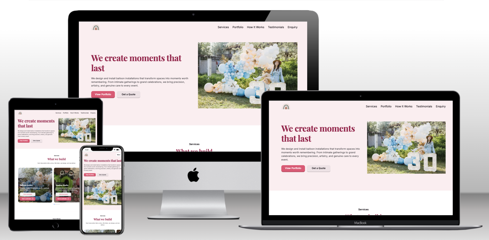

**Live Website:** https://shvetsviktor.github.io/rainbow_me_deco/

## Overview

Rainbow Me Decor Studio is an interactive front-end website for a small event decoration business specialising in balloon arches, balloon garlands, balloon number stacks, sequin backdrops, table centrepieces, seasonal business decorations, party supplies, and custom event styling.

The project was created as a dynamic front-end web application for the Code Institute Unit 2 Interactive Front End Development assessment. It demonstrates responsive layout, user-centred design, JavaScript interactivity, DOM manipulation, external library integration, accessibility considerations, testing, deployment, and project documentation. The opening mockup image shows the finished site. The application is original and built for this specific audience rather than adapted from a walkthrough project.

The website allows visitors to browse decoration services, understand the booking process, view selected decoration work, filter portfolio examples by category, open portfolio images in a larger modal view, add services or portfolio examples to a guide estimate, review selected estimate items, remove items, read testimonials, and submit a validated enquiry form.

The enquiry form currently uses client-side JavaScript validation. A serverless backend integration is now being developed to securely validate submitted data on the server, generate an email from the enquiry details, and deliver it to the business email address. This backend functionality is being developed incrementally using test-driven development.

The project was developed incrementally using a test-driven approach where possible. Key behaviours were first described in Jest tests, then implemented in HTML, CSS, and JavaScript. Testing evidence and validation notes are documented in the Testing section below.

---

## Table of Contents

1. [Project Goals](#project-goals)
2. [Target Audience](#target-audience)
3. [User Stories](#user-stories)
4. [Five Planes of UX](#five-planes-of-ux)
5. [Development Process](#development-process)
6. [Features](#features)
7. [Testing](#testing)
8. [Bugs](#bugs)
9. [Technologies Used](#technologies-used)
10. [Deployment](#deployment)
11. [Attribution, Credits and Acknowledgements](#attribution-credits-and-acknowledgements)
12. [Repo Structure](#repo-structure)
13. [Future Improvements](#future-improvements)

---

## Project Goals

### User Goals

- Understand what the decoration business offers.
- Browse available decoration services quickly and clearly.
- Understand how the booking process works.
- See examples of previous decoration work.
- Filter portfolio examples by relevant decoration type.
- Open images in a larger view to inspect decoration details.
- Add services or portfolio examples to a guide estimate.
- Review selected estimate items before making an enquiry.
- Remove items from the estimate if they change their mind.
- Read customer feedback before making contact.
- Submit an enquiry through a validated form.
- Return to the home page easily if a wrong page is opened.

### Site Owner Goals

- Present decoration services professionally.
- Showcase real gallery images instead of placeholder content.
- Help visitors understand available decoration categories.
- Explain the customer journey from enquiry to celebration.
- Build trust with portfolio examples and testimonials.
- Encourage users to browse previous work before making contact.
- Provide guide pricing to reduce repeated questions.
- Offer an interactive estimate builder to increase engagement.
- Keep project code, data, and assets organised for future maintenance.

### Assessment Goals

- Build a responsive front-end web application.
- Use custom JavaScript to respond to user actions.
- Demonstrate DOM manipulation and dynamic rendering.
- Use an external JavaScript library appropriately.
- Organise code into separate HTML, CSS, and JavaScript files.
- Use Git and GitHub throughout development.
- Use testing to guide and verify functionality.
- Document UX decisions, development process, testing, bugs, and deployment.
- Extend the enquiry form with a secure serverless backend and email delivery workflow.
- Apply server-side validation and defensive controls instead of relying only on browser validation.
- Use test-driven development for backend modules, API handlers, email templates, and request processing.

### Why this project suits the brief

The project matches the unit brief because it is a real-world front-end application for a specific audience, it uses custom JavaScript to control visible interactions, it separates markup, styles, and scripts into external files, and it is documented with testing, deployment, and version control evidence.

---

## Target Audience

The target audience includes:

- Parents organising children’s birthday parties.
- Couples planning weddings or engagement celebrations.
- People planning baby showers, private parties, or family celebrations.
- Small businesses organising launches, displays, promotions, or seasonal events.
- Event planners looking for a balloon and event decoration supplier.

---

## User Stories

### US1 — Understand the Business

As a visitor, I want to understand what the business offers quickly so that I know whether it is relevant to my event.

**Acceptance Criteria:**

- The hero section clearly explains the service.
- The main call-to-action links are visible.
- The navigation is easy to understand.
- The services section is easy to find.
- The page design matches the event decoration theme.

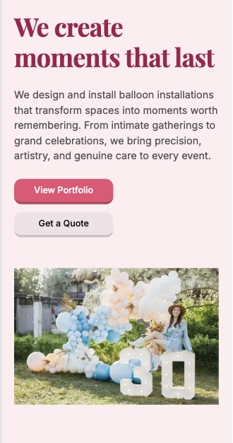

---

### US2 — Browse Services

As a visitor, I want to browse available decoration services so that I can decide whether the business offers what I need.

**Acceptance Criteria:**

- Services are shown in clear cards.
- Each service card includes an image, title, and short description.
- Each service card has a “View examples” button.
- Each service card has an “Add to estimate” button.
- The services layout remains usable on mobile, tablet, and desktop.
- The services carousel is swipe-friendly on touch screens.

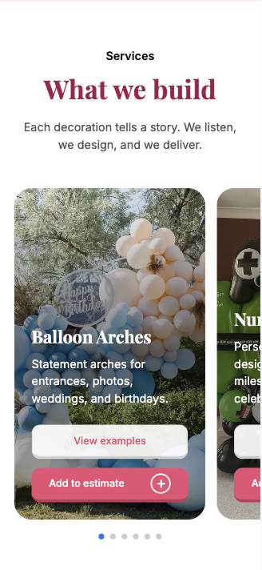

---

### US3 — Understand the Booking Process

As a visitor, I want to understand how the booking and setup process works so that I know what to expect before sending an enquiry.

**Acceptance Criteria:**

- The How It Works section appears after Services.
- Four clear process steps are shown.
- Each step has an icon, number, title, and short explanation.
- The section explains the journey from first enquiry to event celebration.
- The layout works on mobile, tablet, and desktop.
- Decorative icons are hidden from assistive technology where appropriate.

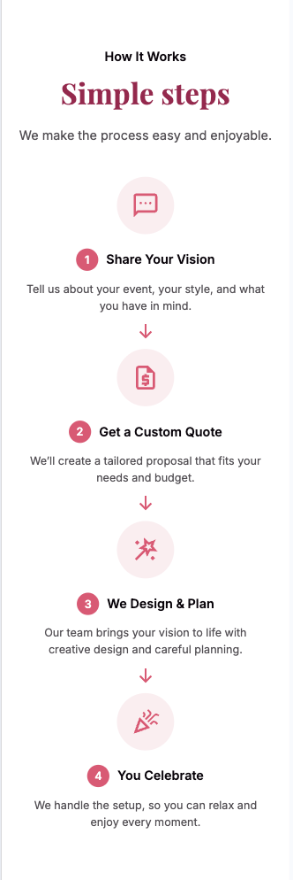

---

### US4 — View Matching Examples from a Service

As a visitor, I want to click a service and see matching portfolio examples so that I can quickly find work relevant to that service.

**Acceptance Criteria:**

- Each service card has a category link.
- Clicking “View examples” scrolls to the portfolio section.
- The matching portfolio filter is activated.
- The portfolio carousel shows relevant examples.
- No console errors occur when the service filter action is used.

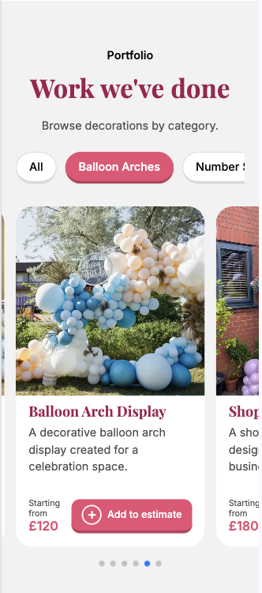

---

### US5 — Browse Portfolio Examples

As a visitor, I want to view examples of previous work so that I can judge the style and quality before making an enquiry.

**Acceptance Criteria:**

- Portfolio cards are rendered dynamically from JavaScript data.
- Portfolio examples are displayed in a responsive carousel.
- Each portfolio item includes an image, title, description, and guide price.
- Portfolio images remain visually consistent across screen sizes.
- Portfolio cards include an “Add to estimate” button.

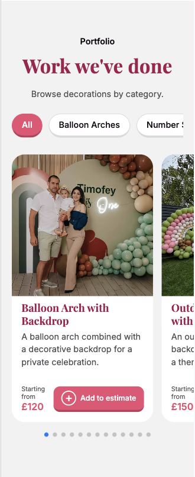

---

### US6 — Filter Portfolio Examples

As a visitor, I want to filter portfolio examples by decoration type so that I can browse work that matches my event.

**Acceptance Criteria:**

- Portfolio filter buttons are visible above the carousel.
- Clicking a filter shows matching portfolio items.
- The active filter is visually highlighted.
- Portfolio items can belong to more than one category.
- The carousel updates after filtering.
- The carousel resets to the first matching item after a new filter is selected.
- No console errors occur when filtering.


---

### US7 — View Images Clearly

As a visitor, I want to open portfolio images in a larger view so that I can see decoration details more clearly.

**Acceptance Criteria:**

- Clicking a portfolio image opens a modal.
- The modal shows the selected image.
- The modal image `src` and `alt` are updated dynamically.
- The modal can be closed with the close button.
- The modal can be closed with the Escape key.
- The modal can be closed by clicking the backdrop.
- The modal uses accessible dialog attributes.

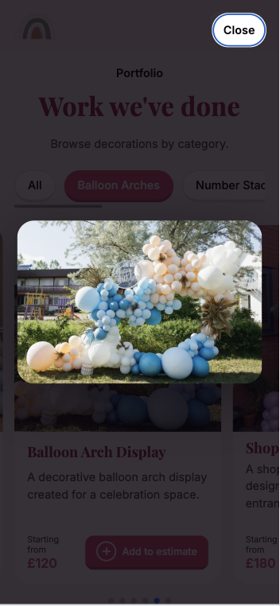

---

### US8 — Build a Guide Estimate

As a visitor, I want to add services and portfolio items to a guide estimate so that I can understand the approximate cost before sending an enquiry.

**Acceptance Criteria:**

- The user can add a service card to the estimate.
- The user can add a portfolio card to the estimate.
- Duplicate items are not added again.
- The estimate widget appears after an item is added.
- The estimate count updates.
- The estimate total updates.
- The estimate panel can be opened.
- Selected items are shown with image, title, and price.
- The user can remove selected items.
- The estimate UI hides when the last item is removed.
- The enquiry section shows a selected estimate summary.
- A small balloon animation confirms when a new item is added.
- The estimate resets after successful enquiry submission.

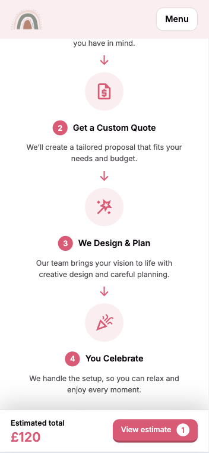

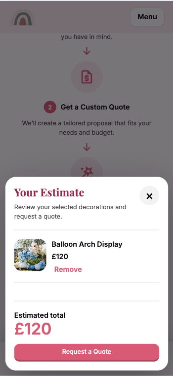

---

### US9 — Read Testimonials

As a visitor, I want to read customer feedback so that I can feel more confident about the service.

**Acceptance Criteria:**

- The Testimonials section appears after Portfolio.
- Three testimonial cards are displayed.
- Each card includes a decorative avatar placeholder, username, rating, and review text.
- Rating stars are visually decorative but have accessible text.
- Real social media screenshots and avatars are not embedded.

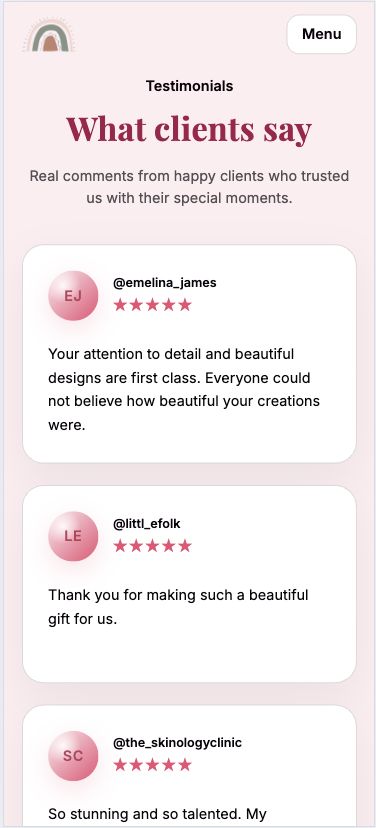

---

### US10 — Send an Enquiry

As a visitor, I want to submit my event details through an enquiry form so that I can request a quote.

**Acceptance Criteria:**

- The enquiry section is available from navigation and call-to-action links.
- The form includes first name, last name, email, phone number, event type, decoration type, event date, event location, message, and submit button.
- Required fields are marked in HTML.
- Empty required fields are rejected.
- Invalid email format is rejected.
- Invalid phone format is rejected.
- Clear error messages are shown.
- Error messages are connected to fields using accessible attributes.
- A success message appears after valid submission.
- After valid submission, the form and distracting enquiry content are hidden.
- The estimate builder is reset after successful submission.

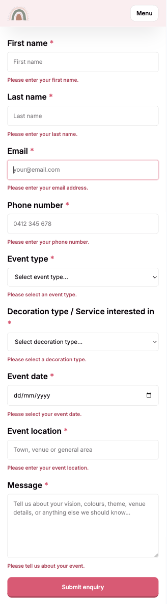

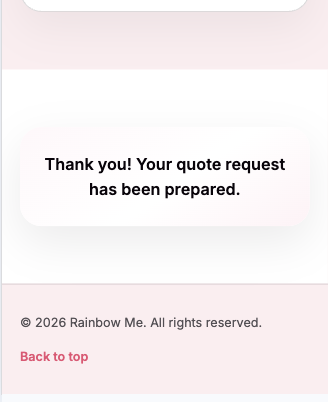

---

### US11 — Use the Website on Mobile

As a mobile visitor, I want navigation and carousels to work comfortably so that I can browse the site on a phone.

**Acceptance Criteria:**

- The mobile navigation can be opened and closed.
- The menu button updates `aria-expanded`.
- Navigation links close the mobile menu after selection.
- Services and portfolio carousels are swipe-friendly.
- Content fits without horizontal scrolling.
- Buttons and text remain readable.
- Form inputs remain easy to use on mobile.

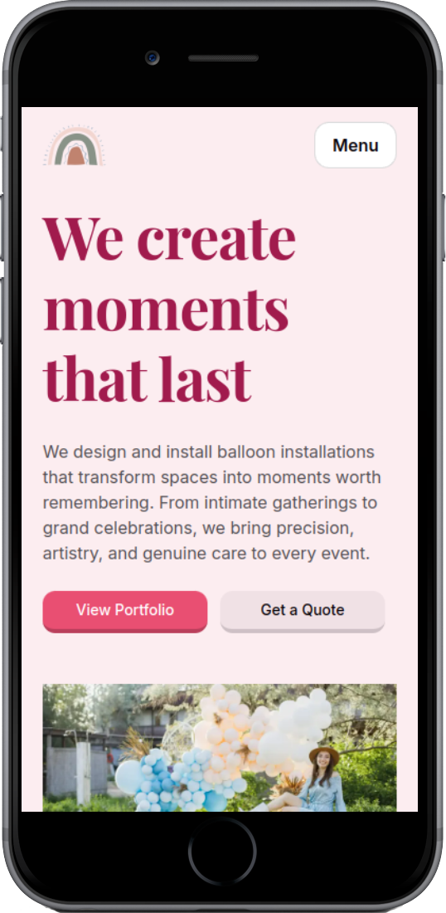

---

### US12 — Recover from a Wrong Page

As a visitor, I want to return to the main page if I open a non-existent page.

**Acceptance Criteria:**

- A custom `404.html` page exists.
- The page explains that the requested page was not found.
- A clear “Back to home” button returns the user to the main page.

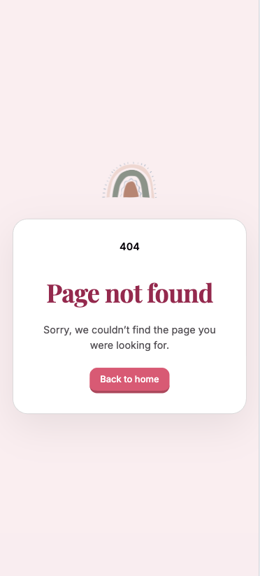

---

### US13 — Maintain the Website

As the site owner or developer, I want the code and assets to be organised clearly so that the website can be maintained and updated.

**Acceptance Criteria:**

- HTML, CSS, and JavaScript are separated.
- JavaScript files are organised by feature.
- Portfolio data is stored separately from markup.
- Portfolio items use a consistent `categories` array format.
- Test fixtures avoid repeated mock data.
- Image assets are stored in organised folders.
- File names are lowercase and descriptive.

---

## Five Planes of UX

The Five Planes of UX were used to organise design decisions from the broad purpose of the project through to the final visual interface.

### Strategy

The strategy is to help potential customers understand the service, trust the quality of previous work, and move towards an enquiry.

The project is based on three priorities:

- **Clarity:** users should quickly understand what Rainbow Me offers.
- **Confidence:** users should see service categories, process steps, portfolio examples, testimonials, and guide prices before contacting the business.
- **Action:** users should be able to filter work, add items to an estimate, and submit an enquiry.

### Scope

The completed project includes:

- Responsive header and navigation.
- Hero section.
- Services Swiper carousel.
- Service cards with “View examples” and “Add to estimate” actions.
- How It Works section.
- Dynamic portfolio rendering.
- Portfolio Swiper carousel.
- Portfolio filter buttons.
- Multi-category portfolio data.
- Portfolio image modal.
- Estimate widget.
- Estimate panel.
- Add/remove estimate functionality.
- Balloon add animation.
- Testimonials section.
- Enquiry form with JavaScript validation.
- Success message state after valid submission.
- Footer with Back to top link.
- Custom 404 page.
- Jest automated tests.
- Shared test fixtures.

### Structure

The final website uses a single-page structure where the header contains the navigation and hero area:

1. **Header and Hero**
2. **Services**
3. **How It Works**
4. **Portfolio**
5. **Testimonials**
6. **Enquiry**
7. **Footer**

This structure was chosen to mix interactive and static content. Services introduce available options, How It Works explains the process, Portfolio provides visual examples, Testimonials add trust, and Enquiry provides the final action point.

### Skeleton / Wireframes

Wireframes were used to plan page layout, content hierarchy, and responsive behaviour before and during implementation.

| Mobile Wireframe                                            | Desktop Wireframe                                             |
| ----------------------------------------------------------- | ------------------------------------------------------------- |
| 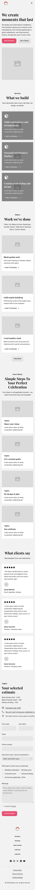 | 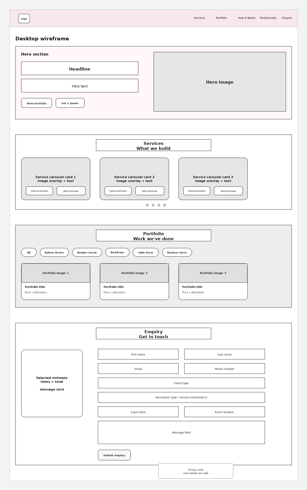 |

### Surface

The visual design is intended to feel:

- Clean
- Soft
- Friendly
- Elegant
- Celebratory
- Professional

Design decisions include:

- Light background.
- Pastel accent colour palette.
- Clear call-to-action buttons.
- Rounded cards.
- Consistent spacing.
- Real gallery images.
- Decorative icons.
- Decorative testimonial avatar placeholders.
- Soft shadows.
- Pink accent colour for actions, highlights, and feedback.
- Decorative balloon feedback animation.

---

## Development Process

The project was developed incrementally over multiple stages. The approach changed during development as features became more complex, but the overall goal remained the same: build a dynamic, responsive, interactive front-end project with clear user value. The structure, content, and interactions were chosen to suit this specific decoration business rather than copied from a generic tutorial pattern.

### Stage 1 — Project Idea and Structure

The project started as a portfolio-style website for balloon compositions and event decoration. The idea was chosen because it allowed strong visual content, clear user interaction, and realistic business value.

Initial planning focused on:

- Page sections.
- Services.
- Portfolio.
- Estimate builder idea.
- Enquiry form.
- Responsive layout.
- Accessibility.
- Testing requirements.

### Stage 2 — HTML Structure and Early Tests

The first technical focus was to create a clear page structure and verify it with automated tests.

Tests were written for:

- Header.
- Navigation.
- Hero section.
- Services section.
- Portfolio section.
- How It Works section.
- Testimonials section.
- Enquiry section.
- Footer.
- Key links.
- Images and alt text.
- Buttons and form elements.

This helped keep the HTML structure stable while new features were added.

### Stage 3 — Services Section and Swiper

The services section was built with six service categories:

- Balloon Arches
- Number Stacks
- Backdrops
- Table Decor
- Business Decor
- Custom Setups

A Swiper carousel was added to make service cards easier to browse on smaller screens. A custom services carousel script checks that the carousel element and Swiper library exist before initialising.

### Stage 4 — How It Works Section

The How It Works section was added after the Services section to explain the booking process before users reach the portfolio.

The final section includes four steps:

1. Share Your Vision
2. Get a Custom Quote
3. We Design & Plan
4. You Celebrate

The section uses icons, numbers, short text, and responsive layout.

### Stage 5 — Dynamic Portfolio Rendering

The portfolio section was moved away from static HTML cards. Portfolio items are stored in `assets/js/portfolio-data.js` and rendered dynamically by JavaScript.

This made the project more maintainable because content data is separated from markup.

The render function creates:

- Portfolio article card.
- Image button.
- Image.
- Title.
- Description.
- Price wrapper.
- Add to estimate button.

### Stage 6 — Portfolio Carousel

The dynamically rendered portfolio cards are displayed in a Swiper carousel.

This keeps the page compact, especially on mobile, and allows visitors to browse images without the page becoming too long.

### Stage 7 — Portfolio Filtering

Portfolio filter buttons were added above the carousel.

The first version used a single category value on each portfolio item:

```js
category: 'balloon-arches';
```

Later, the data model was improved to allow items to belong to multiple categories:

```js
categories: ['balloon-arches', 'backdrops'];
```

This was a more flexible solution because a real decoration photo can show both a balloon arch and a backdrop.

The filter logic now checks whether the selected category is included in the item’s `categories` array.

### Stage 8 — Services Linked to Portfolio Filters

Service cards were connected to matching portfolio filters.

When a visitor clicks “View examples” on a service card:

1. JavaScript reads the service category.
2. It finds the matching portfolio filter button.
3. It triggers that filter.
4. It scrolls to the portfolio section.

This connects the Services and Portfolio sections into one user journey.

### Stage 9 — Portfolio Modal

A portfolio image modal was added so users can view images in a larger format.

The modal supports:

- Opening from image button.
- Dynamic image source.
- Dynamic alt text.
- Close button.
- Escape key.
- Backdrop click.

This improves user control and makes the portfolio more useful.

### Stage 10 — Estimate Builder Pure Functions

The estimate builder was first developed with pure JavaScript functions:

- `addItemToEstimate`
- `calculateEstimateTotal`
- `removeItemFromEstimate`

These functions were tested separately from the DOM. This made the estimate logic easier to understand and verify.

### Stage 11 — Estimate Builder DOM Behaviour

The estimate builder was then connected to the page.

Users can add items from:

- Portfolio cards.
- Service cards.

The estimate UI includes:

- Floating/sticky estimate widget.
- Item count badge.
- Estimated total.
- View estimate button.
- Estimate panel.
- Remove buttons.
- Selected item image, title, and price.
- Backdrop.
- Escape key support.
- Request a Quote button.

### Stage 12 — Estimate Images and Service Data

The estimate panel was improved to show selected item images.

Portfolio items already had image and alt data. Service buttons were updated with:

- `data-title`
- `data-price`
- `data-image`
- `data-alt`

This allows service-added items and portfolio-added items to be rendered consistently inside the estimate panel.

### Stage 13 — Balloon Add Animation

A decorative balloon animation was added when the user adds a new item to the estimate.

The animation appears near the clicked button and gives visual feedback that the action worked.

The animation only appears when a new item is actually added, not when the user clicks a duplicate item.

### Stage 14 — Enquiry Estimate Summary

The estimate builder was connected to the enquiry section.

Selected items are shown in the enquiry summary with:

- Image.
- Title.
- Price.
- Remove button.
- Total guide price.

The sticky estimate widget is hidden when the enquiry summary is visible, so users do not see duplicated estimate information.

### Stage 15 — Enquiry Form Validation

The enquiry form was implemented with JavaScript validation.

Validation checks:

- Required fields.
- Email format.
- Phone format.

When fields are invalid, the form shows clear field-level messages. The script also updates `aria-invalid` and connects error messages to inputs using `aria-describedby`.

After valid submission:

- The success message appears.
- The form is reset.
- The enquiry section hides distracting content.
- The estimate builder receives an `enquiry:submitted` event and resets.

Because the portfolio, filters, modal, estimate widget, and form summary all depend on shared state and dynamically rendered elements, the initialization order matters. The project uses `DOMContentLoaded` and defensive checks so each feature is ready before another feature tries to read or update the same DOM state.

### Stage 16 — Resetting After Form Submission

A bug appeared after successful form submission. If the user submitted the form and then added another estimate item, only the balloon animation appeared and the estimate widget did not restart as expected.

This was fixed by clearing the submitted enquiry state and resetting estimate state correctly when a new item is added after submission.

### Stage 17 — Testimonials Section

The Testimonials section was added after Portfolio to provide social proof before the Enquiry section.

Real social media screenshots and profile images were not embedded. Instead, the section uses:

- Real adapted testimonial text.
- Usernames.
- Decorative CSS avatar placeholders.
- Accessible rating information.

This improves performance, keeps the content accessible, and avoids unnecessary privacy or licensing problems.

### Stage 18 — Footer

A footer was added at the end of the page.

The footer includes:

- Copyright text.
- Back to top link.

### Stage 19 — Custom 404 Page

A custom `404.html` page was added so users have a clear route back to the main site if they open a wrong URL.

The page includes:

- Simple page-not-found message.
- “Back to home” button.

### Stage 20 — Image Migration

The project moved from placeholder/service-specific image folders to real client/gallery images.

The image structure was simplified to use:

```text
assets/images/gallery/
```

This avoids unnecessary duplication between services and portfolio images.

Service card images, service estimate data, portfolio item data, and test fixtures were updated to use the gallery image paths.

### Stage 21 — Shared Test Fixtures

The tests originally repeated small portfolio item arrays in multiple files.

This was refactored into a shared fixture:

```text
tests/fixtures/portfolio-items.js
```

This keeps test data consistent and avoids repeating the same mock portfolio items across multiple test files.

### Stage 22 — Test Organisation

Tests were grouped using `describe` blocks.

Examples:

- `Estimate pure functions`
- `Estimate builder`
- `Portfolio filtering`
- `Portfolio image modal`
- `Portfolio rendering`
- `Main navigation behaviour`
- `Enquiry form validation`
- `404 page`

This made the test suite easier to read and understand.

### Stage 23 — Carousel Reset Bug Fix

A bug was found in the portfolio carousel after filtering.

When a user swiped to a later portfolio slide and then selected a new filter, the carousel kept the previous slide index. The filtered cards changed, but the carousel did not return to the first matching item.

The fix updates the Swiper instance and moves it back to slide `0` after filtering.

### Stage 24 — Styling and Interaction Refinement

CSS was refined during development to improve:

- Spacing.
- Responsive breakpoints.
- Button sizing.
- Portfolio card layout.
- Estimate panel layout.
- Enquiry form layout.
- Success message design.
- Testimonials card design.
- How It Works layout.
- Footer placement.
- Visual consistency.

A pointer cursor was added for key clickable buttons so interactive elements feel clickable.

### Stage 25 — Contact Form Backend and Email Delivery

The original enquiry form used client-side validation and simulated a successful submission without sending the submitted information outside the browser.

A new development stage was started to connect the form to a serverless backend. The planned backend workflow is:

1. Receive the enquiry through a serverless API endpoint.
2. Restrict the endpoint to supported HTTP requests.
3. Validate and normalise submitted data on the server.
4. Apply spam and abuse protection.
5. Generate HTML and plain-text email content for the business.
6. Send the enquiry details to the configured business email address.
7. Generate and send an acknowledgement email to the customer.
8. Return a structured success or error response.
9. Update the frontend according to the backend response.

The backend is being developed using small test-driven development cycles:

**Red → Green → Refactor**

Backend responsibilities are being separated into focused modules where appropriate:

- API request handling.
- Enquiry data validation.
- Email template generation.
- Email delivery.
- Spam and request protection.
- Environment configuration.

This separation is intended to make the implementation easier to test, maintain, and explain.

---

## Features

### Hero

The hero section introduces the business and includes two call-to-action links:

- View Portfolio
- Get a Quote

### Main Navigation

The navigation links to the main page sections:

- Services
- How It Works
- Portfolio
- Testimonials
- Enquiry

The mobile menu can be opened and closed with a menu button. When a navigation link is clicked, the mobile menu closes.

### Services Carousel

The services section uses Swiper.js to display service cards.

Each service card includes:

- Image.
- Heading.
- Description.
- “View examples” button.
- “Add to estimate” button.

The services use gallery images from `assets/images/gallery/`.

### How It Works

The How It Works section explains the booking process in four steps:

1. Share Your Vision
2. Get a Custom Quote
3. We Design & Plan
4. You Celebrate

The section uses icons, step numbers, headings, and short descriptions.

### Portfolio

Portfolio cards are rendered dynamically from `portfolio-data.js`.

Each portfolio item contains:

- `id`
- `title`
- `categories`
- `image`
- `alt`
- `description`
- `price`

### Portfolio Filtering

Portfolio filters allow users to filter by:

- All
- Balloon Arches
- Number Stacks
- Backdrops
- Table Decor
- Business Decor
- Custom Setups

The filtering supports multiple categories per portfolio item.

After filtering, the portfolio carousel resets to the first matching slide.

### Portfolio Image Modal

The modal lets users view larger portfolio images.

It supports:

- Close button.
- Escape key.
- Backdrop click.
- Dynamic image source.
- Dynamic image alt text.

### Estimate Widget

The estimate widget appears after the first item is added.

It shows:

- Current estimate total.
- Item count.
- View estimate button.
- Count badge.

### Estimate Panel

The estimate panel shows selected items with:

- Image.
- Title.
- Price.
- Remove button.

It also shows the current total and a Request a Quote button.

### Add to Estimate

Users can add items from both service cards and portfolio cards.

Duplicate items are prevented, so clicking the same Add to estimate button again does not change the estimate.

### Remove from Estimate

Users can remove items from the estimate panel or the enquiry estimate summary.

When the final item is removed, the estimate UI hides.

### Balloon Add Animation

A small balloon animation appears near the clicked Add to Estimate button when a new item is added.

### Testimonials

The Testimonials section shows three customer comments.

Each testimonial card includes:

- Decorative avatar placeholder.
- Username.
- Accessible 5-star rating.
- Review text.

### Enquiry Form

The enquiry form includes:

- First name.
- Last name.
- Email.
- Phone number.
- Event type.
- Decoration type / service interested in.
- Event date.
- Event location.
- Message.
- Submit button.
- Privacy note.

The form validates input and shows a success message after valid submission.

### Footer

The footer includes:

- Copyright text.
- Back to top link.

### Custom 404 Page

The custom 404 page provides a clear message and a Back to home button.

---

## Testing

Testing was a major part of the project development process. Automated Jest tests were used to check pure JavaScript functions and DOM behaviour. Manual testing was used to check real user flows, responsiveness, accessibility, deployed behaviour, and visual layout.

Automated testing is most useful for repeatable technical checks such as pure functions, DOM updates, validation states, and regression coverage. Manual testing is most useful for end-to-end user flows, layout checks, touch interactions, visual feedback, and overall usability.

Automated testing evidence is included below alongside the manual testing results.

### Automated Testing

Automated tests are stored in the `tests/` folder.

| Test Area               | Purpose                                                                                                                            |
| ----------------------- | ---------------------------------------------------------------------------------------------------------------------------------- |
| Estimate pure functions | Tests add item, prevent duplicate, calculate total, and remove item                                                                |
| Estimate DOM behaviour  | Tests widget, panel, item adding, item removal, totals, images, backdrop, Escape key, and balloon animation                        |
| Page structure          | Tests main sections, navigation links, service cards, portfolio structure, enquiry structure, footer, and accessibility attributes |
| Navigation              | Tests mobile menu toggle and closing menu after link click                                                                         |
| Portfolio filters       | Tests filter data, rendering filter buttons, active filter state, category filtering, and service-to-portfolio filter links        |
| Portfolio modal         | Tests modal opening, closing, Escape key, backdrop click, and image updates                                                        |
| Portfolio rendering     | Tests dynamic portfolio card rendering and portfolio Swiper initialisation                                                         |
| Swiper helpers          | Tests that Swiper pagination bullets are removed from keyboard tab order                                                           |
| Enquiry form            | Tests required fields, email validation, phone validation, success message, and submitted state                                    |
| 404 page                | Tests page-not-found content and Back to home link                                                                                 |

### Shared Test Fixtures

Reusable test portfolio items are stored in:

```text
tests/fixtures/portfolio-items.js
```

This avoids repeating the same portfolio mock data across several test files.

### Running Tests

```bash
npm test
```

### Automated Test Evidence

Automated test runs are documented with Jest and summarised in the tables above.

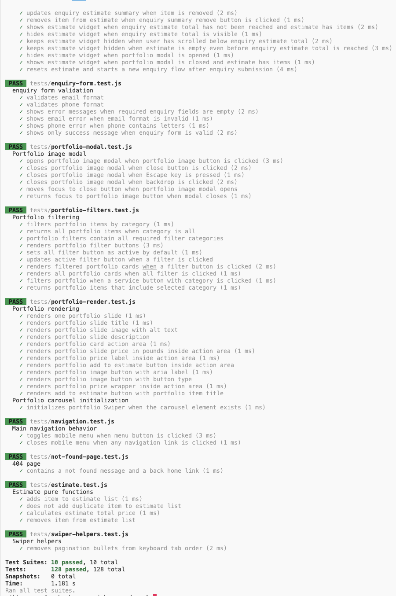

---

## Manual Testing

Manual testing was used to check real user interaction, visual layout, responsiveness, accessibility, and deployed behaviour.

| Feature            | Test                               | Expected Result                                    | Status |
| ------------------ | ---------------------------------- | -------------------------------------------------- | ------ |
| Navigation         | Click each navigation link         | Correct section is shown                           | Pass   |
| Mobile navigation  | Click menu button                  | Menu opens and closes                              | Pass   |
| Mobile navigation  | Click a nav link                   | Menu closes after link click                       | Pass   |
| Hero CTA           | Click “View Portfolio”             | Portfolio section is shown                         | Pass   |
| Hero CTA           | Click “Get a Quote”                | Enquiry section is shown                           | Pass   |
| Services           | View services section              | Six service cards are displayed                    | Pass   |
| Services carousel  | Swipe on mobile                    | Carousel moves through service cards               | Pass   |
| Services           | Click “View examples”              | Matching portfolio filter is selected              | Pass   |
| Services           | Click “Add to estimate”            | Service is added to estimate                       | Pass   |
| How It Works       | View section on mobile and desktop | Four steps remain readable                         | Pass   |
| Portfolio          | Load page                          | Portfolio cards are rendered dynamically           | Pass   |
| Portfolio carousel | Swipe portfolio carousel           | Slides move correctly                              | Pass   |
| Portfolio filter   | Click “Balloon Arches”             | Matching items are shown                           | Pass   |
| Portfolio filter   | Click “Backdrops”                  | Matching items are shown                           | Pass   |
| Portfolio filter   | Click “All”                        | All items are shown                                | Pass   |
| Portfolio filter   | Filter after swiping               | Carousel resets to first matching item             | Pass   |
| Portfolio modal    | Click image                        | Modal opens with selected image                    | Pass   |
| Portfolio modal    | Click close button                 | Modal closes                                       | Pass   |
| Portfolio modal    | Press Escape                       | Modal closes                                       | Pass   |
| Portfolio modal    | Click backdrop                     | Modal closes                                       | Pass   |
| Estimate           | Add portfolio item                 | Item appears in estimate                           | Pass   |
| Estimate           | Add service item                   | Item appears in estimate                           | Pass   |
| Estimate           | Add duplicate item                 | Duplicate is not added                             | Pass   |
| Estimate           | Open estimate panel                | Selected items are shown                           | Pass   |
| Estimate           | Remove item                        | Item is removed and total updates                  | Pass   |
| Estimate           | Remove final item                  | Estimate UI hides                                  | Pass   |
| Estimate           | Click Request a Quote              | Estimate panel closes and enquiry section is shown | Pass   |
| Testimonials       | View testimonials                  | Three testimonial cards are displayed              | Pass   |
| Enquiry form       | Submit empty form                  | Error messages are shown                           | Pass   |
| Enquiry form       | Submit invalid email               | Email error is shown                               | Pass   |
| Enquiry form       | Submit invalid phone               | Phone error is shown                               | Pass   |
| Enquiry form       | Submit valid form                  | Success message is shown                           | Pass   |
| After submission   | Add new estimate item              | Submitted state clears and estimate flow restarts  | Pass   |
| Footer             | Click Back to top                  | Page returns to hero section                       | Pass   |
| 404 page           | Open invalid URL                   | Custom 404 page appears                            | Pass   |
| 404 page           | Click Back to home                 | User returns to main page                          | Pass   |
| Console            | Perform main user actions          | No console errors appear                           | Pass   |
| Deployed version   | Compare local and deployed site    | Deployed version matches local version             | Pass   |
| Final code review  | Check for broken links/comments    | No broken internal links or unnecessary comments   | Pass   |

### Screenshots Aligned to User Stories

<details>
<summary>View screenshots aligned to user stories</summary>

#### US1 — Understand the Business


#### US2 — Browse Services


#### US3 — Understand the Booking Process


#### US5 — Browse Portfolio Examples


#### US6 — Filter Portfolio Examples


#### US7 — View Images Clearly


#### US8 — Build a Guide Estimate


#### US9 — Read Testimonials


#### US10 — Send an Enquiry


#### US11 — Use the Website on Mobile


#### US12 — Recover from a Wrong Page


</details>

---

## Responsiveness Testing

| Device / Width     | Expected Result                                                      | Status |
| ------------------ | -------------------------------------------------------------------- | ------ |
| 320px mobile       | Content fits without horizontal scroll                               | Pass   |
| 375px mobile       | Layout remains readable and usable                                   | Pass   |
| 560px large mobile | How It Works adapts into a wider responsive layout where appropriate | Pass   |
| 768px tablet       | Navigation and section layouts adapt correctly                       | Pass   |
| 1024px laptop      | Layout remains readable before full desktop enquiry split            | Pass   |
| 1025px+ desktop    | Enquiry switches to two-column layout                                | Pass   |
| 1440px desktop     | Full layout displays professionally                                  | Pass   |

---

## Accessibility Considerations

Accessibility was considered during development.

Implemented accessibility decisions include:

- Semantic HTML structure.
- Main navigation uses an accessible label.
- Mobile menu button uses `aria-expanded`.
- Images include alt text.
- Decorative icons use `aria-hidden` where appropriate.
- Decorative testimonial avatars are hidden from assistive technology.
- Testimonial ratings use accessible text.
- Portfolio modal uses dialog attributes.
- Modal has a clear close button.
- Escape key closes modal and estimate panel.
- Form inputs use labels.
- Form validation uses `aria-invalid`.
- Error messages are connected with `aria-describedby`.
- Swiper pagination bullets are removed from keyboard tab order.
- Buttons use clear text.
- Clickable elements use pointer cursor.
- The success message is visually prominent after valid form submission.

---

## Validation

### HTML Validation

HTML was tested using the W3C HTML Validator.

**index.html:**
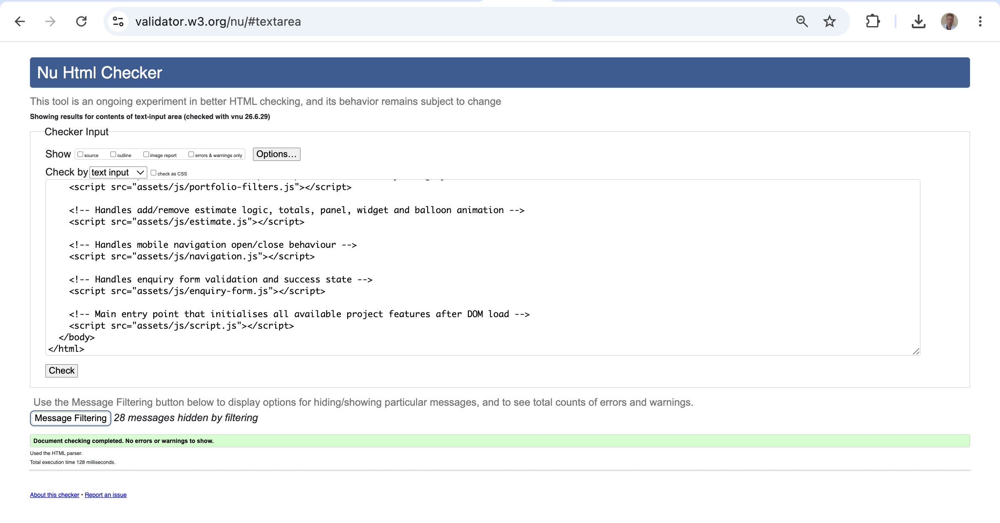

**404.html:**
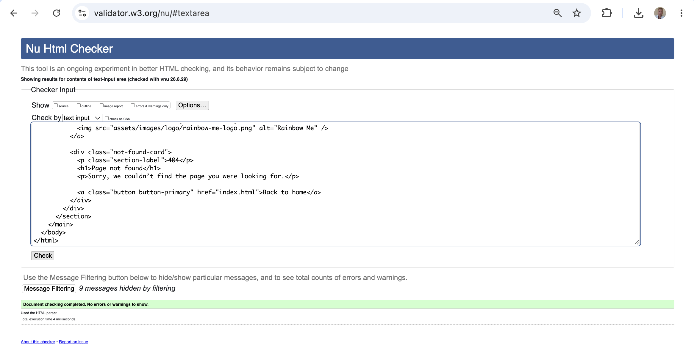

**Result:** Pass.

### CSS Validation

CSS was tested using the W3C Jigsaw CSS Validator.

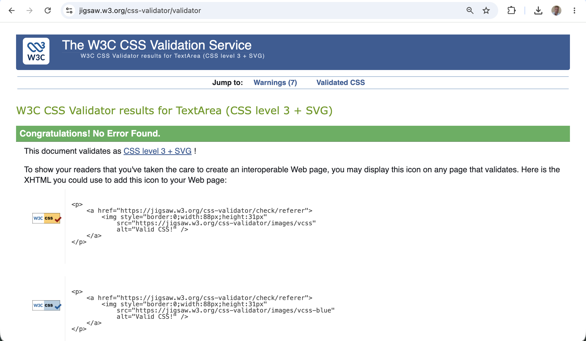

**Result:** Pass.

### JavaScript Linting

JavaScript was tested with JSHint.

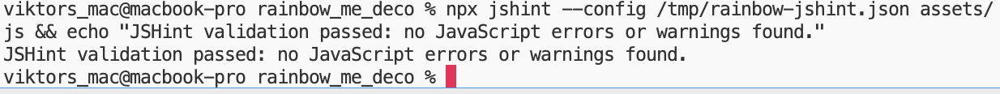

**Result:** Pass.

### Lighthouse Testing

The deployed website was tested using Lighthouse in Chrome DevTools.

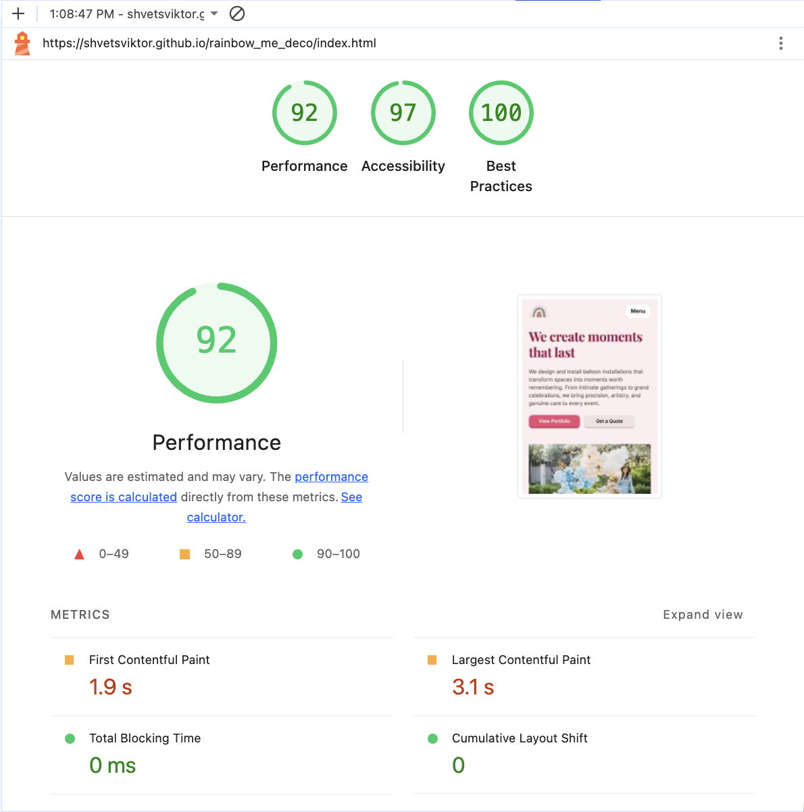

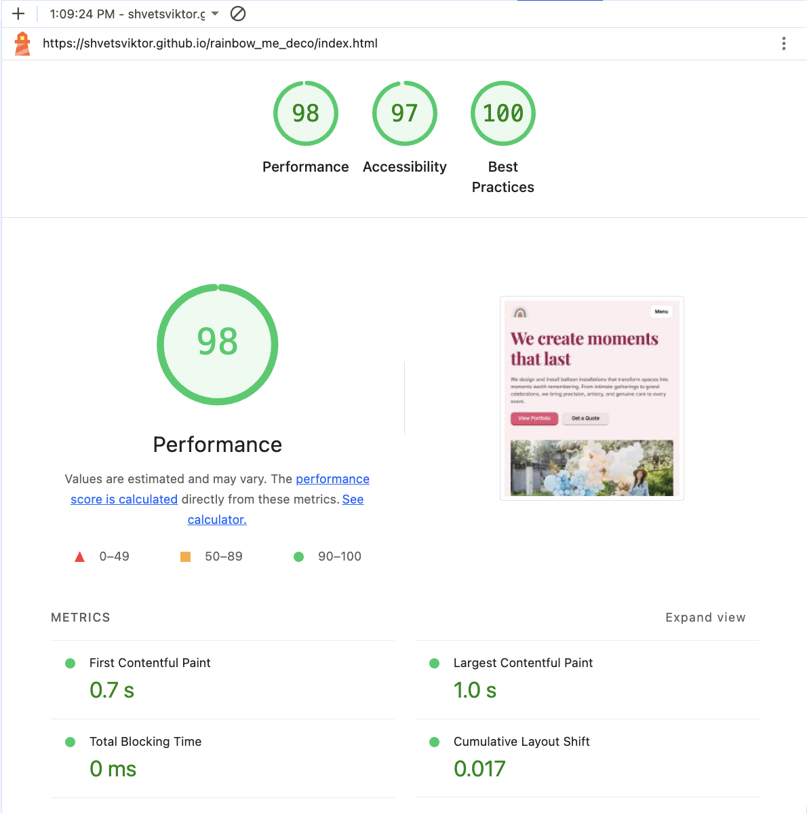

---

## Bugs

During development, bugs were recorded, tested, and fixed as part of the incremental build process. Most issues were found during Jest testing, manual interaction testing, responsive layout checks, or final README review.

The table below summarises the main fixed bugs. One detailed bug example is included after the table to show how a more complex issue was identified, reproduced, fixed, and retested.

### Fixed Bugs Summary

| Bug                                                                         | Cause                                                                                   | Fix                                                                                             | Status |
| --------------------------------------------------------------------------- | --------------------------------------------------------------------------------------- | ----------------------------------------------------------------------------------------------- | ------ |
| Portfolio filtering failed after changing from `category` to `categories`.  | Some test data and project data still used the old single-category format.              | Portfolio items and test fixtures were migrated to the `categories` array format.               | Fixed  |
| Portfolio carousel did not reset after filtering.                           | Swiper kept the previous active slide index after the DOM was re-rendered.              | After filtering, the Swiper instance is updated and moved back to slide `0`.                    | Fixed  |
| Service items in the estimate did not have images.                          | Service buttons originally only provided title and price data.                          | Service buttons were updated with `data-image` and `data-alt` attributes.                       | Fixed  |
| Estimate panel did not show selected item images.                           | Estimate list rendering only included text and price.                                   | Estimate list items now render image, title, price, and remove button.                          | Fixed  |
| Repeated portfolio mock data existed across several tests.                  | Each test file created its own mock portfolio array.                                    | Shared fixture data was moved to `tests/fixtures/portfolio-items.js`.                           | Fixed  |
| Jest failed because `serviceAddButton` was declared twice.                  | During test refactoring, the helper return and manual query used the same `const` name. | The duplicate declaration was removed.                                                          | Fixed  |
| Portfolio and services used separate image folders.                         | Placeholder images were organised separately from real gallery images.                  | Services and portfolio data were migrated to `assets/images/gallery/`.                          | Fixed  |
| Portfolio card filtering did not support items with multiple visual roles.  | A single `category` string was too limited for real decoration examples.                | Items now use `categories` arrays, allowing one item to appear under multiple filters.          | Fixed  |
| Swiper pagination bullets could receive keyboard focus unnecessarily.       | Swiper generated pagination bullets that could be reached with keyboard tabbing.        | A helper removes pagination bullets from the keyboard tab order.                                | Fixed  |
| Disabled Swiper arrows opened a portfolio modal when clicked.               | Swiper disabled arrows allowed pointer clicks to pass through to the card underneath.   | Disabled carousel arrows now keep pointer events so the click is caught by the arrow.           | Fixed  |
| Form success message was not visually focused enough.                       | The success message appeared while other enquiry section elements were still visible.   | The enquiry section now hides form fields and other distracting content after valid submission. | Fixed  |
| Estimate widget did not restart correctly after successful form submission. | The enquiry submitted state remained active after a new item was added.                 | Adding a new item after submission clears the submitted state and restarts the estimate flow.   | Fixed  |
| 404 page test failed because Back to home text was not visible as expected. | The test expected visible link text, but the markup did not match.                      | The 404 page link text was corrected.                                                           | Fixed  |

### Detailed Bug Example: Portfolio Carousel Reset After Filtering

#### Title

Portfolio carousel kept the previous slide position after selecting a new filter.

#### User Story

As a visitor, I want the portfolio carousel to start from the first matching item after I select a new filter, so that I can browse the selected category from the beginning instead of landing on a later slide.

#### Steps to Reproduce

1. Open the website.
2. Go to the Portfolio section.
3. Swipe or click through the portfolio carousel to a later slide.
4. Click a different portfolio filter.
5. Observe the carousel position.

#### Expected Result

The filtered portfolio carousel starts from the first matching item.

#### Actual Result

The portfolio content updated, but the carousel kept the previous slide index.

#### Cause

Swiper kept its previous active slide index after the slide DOM was re-rendered.

#### Fix

After filtering and re-rendering the slides, the Swiper instance is updated and moved back to the first slide.

```js
if (portfolioSwiperElement && portfolioSwiperElement.swiper) {
  portfolioSwiperElement.swiper.update();
  portfolioSwiperElement.swiper.slideTo(0, 0);
}
```

#### Retest

The issue was retested manually by swiping to a later portfolio slide, selecting a different filter, and confirming that the carousel returned to the first matching item.

#### Status

Fixed.

### Known Bugs

No confirmed active bugs are currently documented.

## Technologies Used

### Main Technologies

- HTML5
- CSS3
- JavaScript

### Libraries

- Swiper.js
- Google Fonts

### Testing

- Jest
- Jest jsdom environment

### Development Tools

- Visual Studio Code
- Chrome DevTools
- Git
- GitHub
- GitHub Pages

### Validation and Audit Tools

- W3C HTML Validator
- W3C CSS Validator / Jigsaw
- Lighthouse
- JSHint

### Image Tools

- WebP image format.
- Local image conversion and optimisation workflow.
- WebSiteMockupGenerator, used to create responsive mockup images from the finished site.
- Techsini, used to create the opening README mockup from the finished site.

---

## Deployment

The project is deployed to GitHub Pages.

### Deployment Steps

1. Create a GitHub repository.
2. Push the project files to GitHub.
3. Open the repository on GitHub.
4. Go to **Settings**.
5. Select **Pages**.
6. Under **Build and deployment**, choose:
   - Source: Deploy from a branch
   - Branch: `main`
   - Folder: `/root`
7. Save the settings.
8. Wait for GitHub Pages to build the site.
9. Open the live URL.
10. Test the deployed version against the local version.

### Local Development

To run the project locally:

```bash
python3 -m http.server
```

Then open:

```text
http://localhost:8000
```

### Custom 404 Page

A `404.html` file is included in the project root. GitHub Pages automatically serves this file when a user opens a non-existent route.

The page includes a short message and a Back to home button.

---

## Attribution, Credits and Acknowledgements

### Libraries and Tools

- **Swiper.js:** Used for the responsive Services and Portfolio carousels.
- **Google Fonts:** Used for typography.
- **Jest:** Used for automated JavaScript testing.
- **Jest jsdom:** Used to test DOM-based JavaScript behaviour.
- **Chrome DevTools:** Used for layout testing, debugging, console checks, and Lighthouse.
- **W3C HTML Validator:** Used for HTML validation.
- **Jigsaw CSS Validator:** Used for CSS validation.
- **Git and GitHub:** Used for version control.
- **GitHub Pages:** Used for deployment.

### Image Attribution

The project uses locally stored images in:

```text
assets/images/hero/
assets/images/logo/
assets/images/gallery/
```

No external stock images are embedded in the final version. Gallery, hero, and logo images were stored locally and converted or optimised where needed for performance and consistency.

### Image Optimisation

Images were converted to WebP and resized into responsive variants where appropriate. This reduced file size, improved load performance, and made it possible to use responsive image loading patterns in the hero, services, and portfolio sections.

### Icons

Icons used in the How It Works section are decorative and are stored locally in `assets/icons/` as SVG files. They were sourced from Google Fonts Material Symbols and are treated as non-essential content for accessibility.

### Testimonials

The testimonial text was adapted from publicly visible customer comments. Real social media screenshots and profile images were not embedded in the site to improve accessibility, performance, and privacy.

### Code Attribution

All custom HTML, CSS, and JavaScript code was written and adapted by me, with AI assistance used only as support during development.

External library code is not copied manually into the project. Swiper is loaded from a CDN and configured through custom JavaScript.

### Support and Learning Resources

- **MDN Web Docs:** Used as a reference for HTML, CSS, JavaScript, DOM methods, events, accessibility, and forms.
- **ChatGPT:** Used for planning support, debugging explanations, README structure, code review, and refactoring suggestions.
- **GitHub Copilot:** Used for coding support and quick refinement suggestions.
- **WebSiteMockupGenerator:** Used to create responsive mockup images from the finished site.
- **Techsini:** Used to create the opening README mockup from the finished site.

---

## Repo Structure

```text
assets/
  css/
    style.css
  favicon/
    icon-16.png
    icon-32.png
  icons/
  images/
    gallery/
      responsive/
    hero/
      responsive/
    logo/
      responsive/
  js/
    enquiry-form.js
    estimate.js
    navigation.js
    portfolio-carousel.js
    portfolio-data.js
    portfolio-filters.js
    portfolio-modal.js
    script.js
    services-carousel.js
    swiper-helpers.js
  readme/
    screenshots/
    testing/
  wireframes/
tests/
  fixtures/
    portfolio-items.js
404.html
index.html
package-lock.json
package.json
README.md
```

---

## Future Improvements

Possible future improvements include:

- Connect the enquiry form to a real backend or serverless form handler.
- Save estimate choices between visits using local storage.
- Add a larger dedicated portfolio page.
- Add an admin-friendly way to update portfolio data.
- Add real customer review submission.
- Add booking calendar integration.
- Add multi-language support.
- Add reduced-motion preference support for decorative animations.
- Improve image loading using responsive `srcset` where needed.
- Add payment or deposit functionality.
- Add more detailed service packages and pricing.
- Add social links
